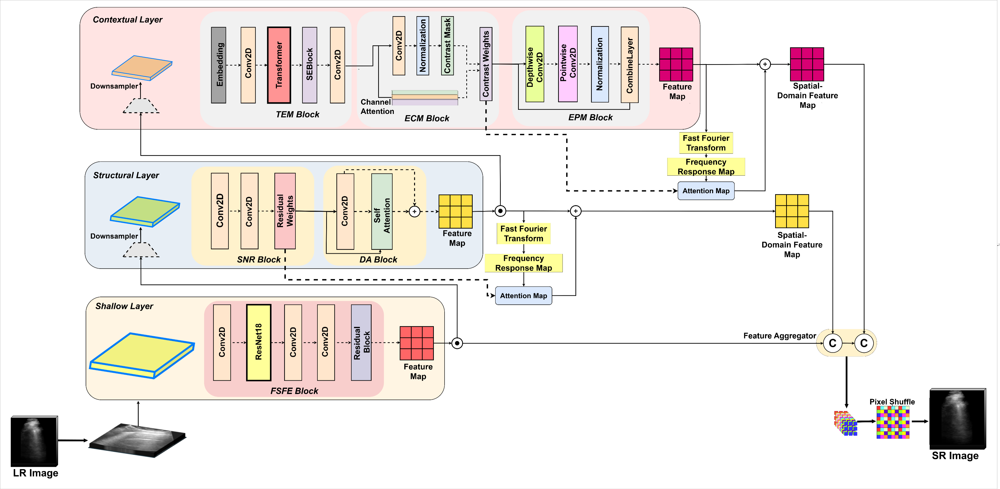
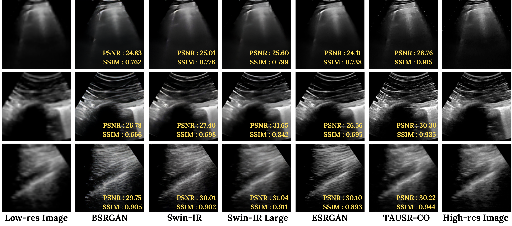
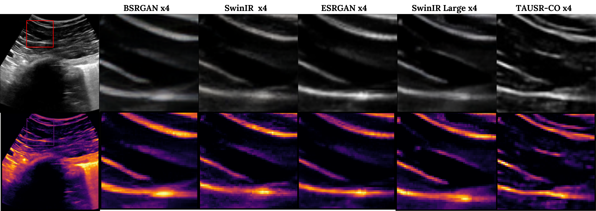

# TAUSR-CO: Texture-Attentive Ultrasound Super-Resolution with Contrast Optimization

This repository contains a modular implementation of the TAUSR-CO architecture described in our  MICCAI 2025 submission.
TAUSR-CO is a hierarchical, frequency-aware super-resolution model designed specifically for ultrasound imaging.  
It integrates spatial and spectral attention across three progressive layers to restore fine-grained texture and contrast.

## 🚀 Highlights
- Shallow → Structural → Contextual multi-layer processing
- Frequency & spatial domain fusion using FFT
- Contrast enhancement, speckle suppression, and depth-aware refinement
- Modularized for easy expansion and experimentation

> 📌 **Note**: Full training code and pretrained models will be released upon paper acceptance.

---

## 📁 Repository Structure

- `models/` – All architectural blocks (FSFE, TEM, SNR, ECM, EPM, etc.)
- `core/` – Training and inference pipelines
- `utils/` – Utility functions for FFT, metrics, plotting
- `configs/` – Configurations for training and testing
- `tests/` – Unit and regression tests
- `assets/` – Figures, diagrams, and illustrations
- `data/` – Placeholder for dataset structure

---

## 🧪 Sample Run

```bash
python main.py --config configs/config.yaml
```

## 📦 Requirements

See `requirements.txt` for dependencies.

## 📝 Citation
BibTeX will be added post acceptance at MICCAI.
---

## 📸 Visual Results

### Architecture Diagram


### Comparison with SOTA Models


### Ultrasound Texture + Contrast Restoration

